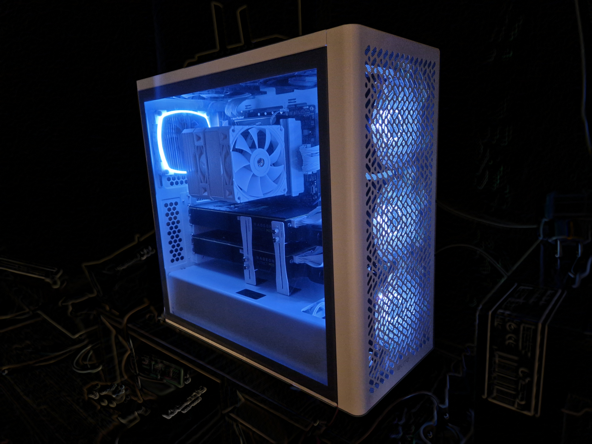

# NiceRGBLight

# 5V ARGB Dual Strip Controller (Arduino)

Minimalistic and reliable controller for **5V 3-pin ARGB (addressable RGB)** LED strips using Arduino.

Designed for **PC modding, custom cooling setups, and other rigs**, where simple, stable, and hardware-level RGB control is preferred over bloated software stacks.

---

## 🔌 What is this?

This project controls **addressable RGB (ARGB)** LED strips (5V, 3-pin: VCC + GND + DATA), similar to:

* WS2812B
* SK6812
* Standard PC ARGB headers

It supports:

* Two independent LED outputs
* Button-controlled color switching
* EEPROM persistence (remembers last mode)
* Smooth rainbow animation
* Static color presets

---

## ⚡ Hardware Overview

Typical ARGB wiring:

* **5V** → Power
* **GND** → Ground
* **DATA** → Signal

⚠️ **Important:**
This is **5V ARGB (3-pin)** — NOT compatible with 12V RGB (4-pin).

---

## 🧩 Features

* ✅ Dual LED strip control (e.g. 20 + 6 LEDs)
* ✅ Single-button UI (mode switching)
* ✅ EEPROM mode persistence
* ✅ Debounced input handling
* ✅ Smooth rainbow animation
* ✅ Multiple predefined static colors
* ✅ Startup diagnostic color sweep

---

## 🎨 Modes

| Mode | Description                            |
| ---- | -------------------------------------- |
| 0    | Rainbow animation                      |
| 1–16 | Static colors (red, green, blue, etc.) |
| 16   | Custom color                           |

---

## 🔘 Controls

* **Short press button** → switch mode
* State is automatically saved to EEPROM

---

## 🛠️ Build

Step-by-step instructions to compile and upload the controller firmware are provided in [Build Firmware](./Build_Firmware.md).

---

## 🔌 Wiring / Connection Diagram

Detailed wiring diagrams and pinout information for connecting ARGB LED strips to the Arduino controller are also included in [Wiring Diagram](./Wiring_Diagram.md).

---

## 🚀 Usage

1. Connect ARGB strips to Arduino
2. Upload the sketch
3. Power the LEDs (external 5V recommended)
4. Use the button to switch modes

---

## ⚠️ Power Notes

* Do NOT power large LED strips directly from Arduino
* Use external 5V PSU for anything > ~10 LEDs
* Share common GND between PSU and Arduino

---

## 🧠 Design Philosophy

This project intentionally avoids:

* USB control software
* RGB ecosystems (Aura, Mystic Light, etc.)
* OS dependencies

Instead, it provides:

> deterministic, low-level, always-working RGB control

Perfect for:

* GPU rigs
* Servers
* Custom cooling setups
* Minimalist builds

---

## 📄 License

MIT License

---

## ⚙️ Keywords

ARGB, 5V RGB, addressable RGB, WS2812B, Arduino RGB controller, PC modding, LED strip controller
