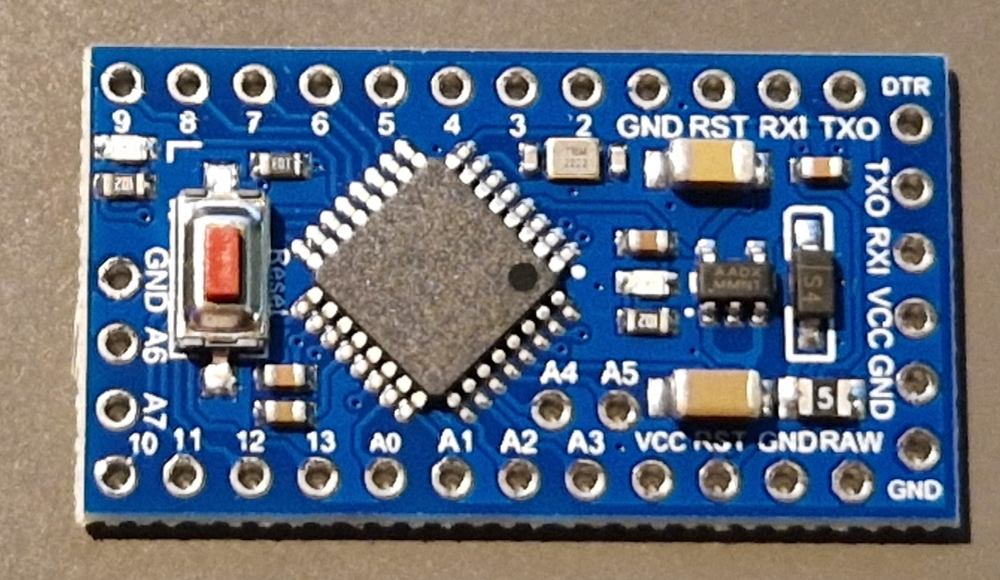
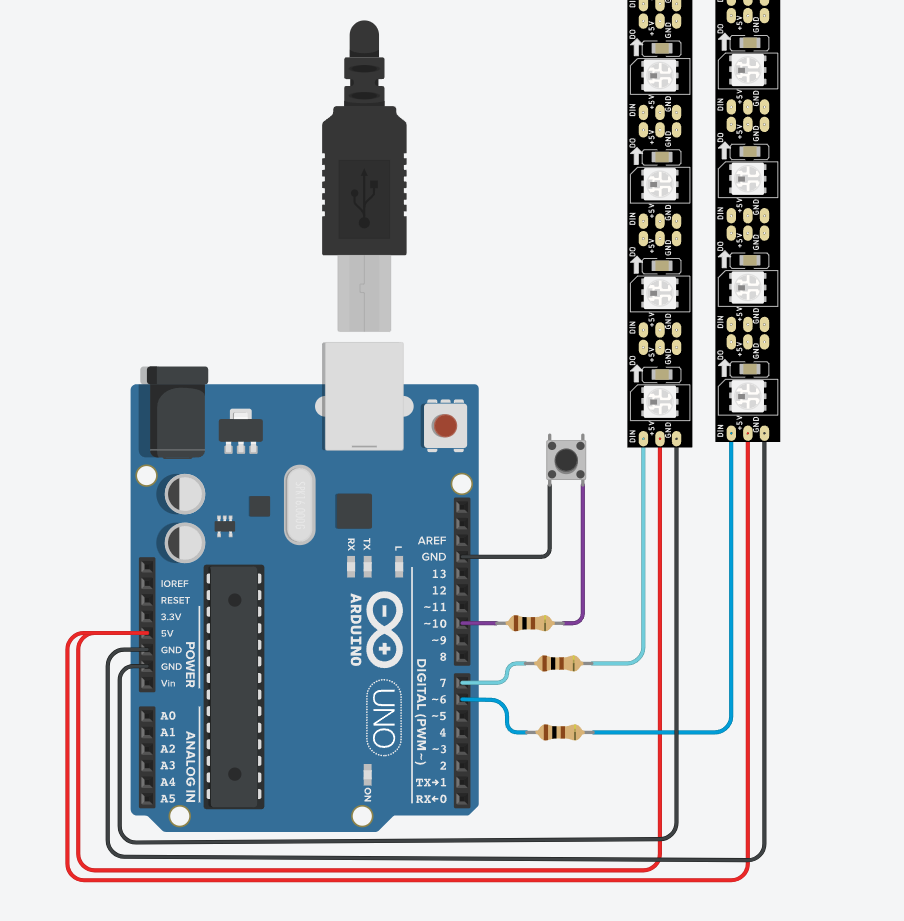
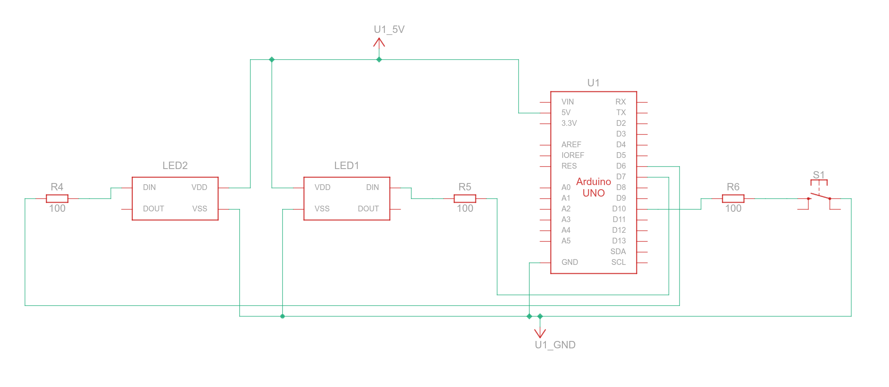

# 🔌 Wiring / Connection (Arduino Pro Mini)

## Board view connection
> Note: Arduino Pro Mini view not available, but pin connections and naming are the same.  
> 5V line is **VCC**.  
> Do not use the RAW input when powering the board if the LED strips are powered from the board’s 5V/VCC pin, as this may overheat and damage the internal DC/DC regulator.

### LED Strips
- **DATA** → through **100Ω resistor** to Arduino `D6` / `D7`  
- **VCC** → 5V (external supply)  
- **GND** → common GND with Arduino  

### Button
- Connect between `BUTTON_PIN` (D10) and GND  
- Add **100Ω resistor in series** to protect the input  
- Use `INPUT_PULLUP` in code (no external pull-up needed)

> ⚠️ Use an external 5V power supply for LED strips longer than ~10 LEDs.  
> Always share a common ground between Arduino Pro Mini and LED power supply.

## Circuit schematic

